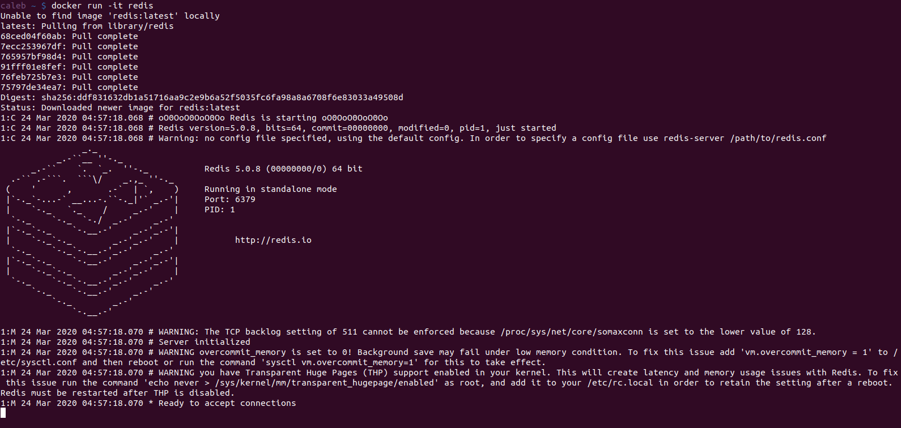

 In today’s age of cloud computing, developing applications on the cloud is a good way to ensure the sustainability of businesses as these applications can be easily scaled to meet the growing needs of the business. However, the infrastructure and technologies required to develop these applications on the cloud could prove complex and difficult to understand for anyone looking to move past having some interest in cloud-native applications. 

## Overview 

This is the first in a series of articles that aim to explore practical steps to developing a production workflow for our cloud applications. We’d be making use of an application that has a UI and web server, and makes use of a Redis cache, and PostgreSQL database.  

These logical units would be properly bundled up with [Docker](https://docker.com/) and dynamically scaled up with [Kubernetes](https://kubernetes.io/), a buzzword in today’s cloud engineering environment, which we would explore in this series.  

In this article, we would explore the world of Docker and why it is quite popular in our tech world.
****
## Prerequisites
- Familiarity with Bash and the Linux terminal.
- [Docker](https://www.docker.com/) installed on your local machine. See the installation guides [here](https://docs.docker.com/install/).

## Basic Setup

Though this series doesn’t intend to focus on a particular dev stack, we would be working with a Node.js and React application setup that uses calculates the value of an index in the Fibonacci sequence. Expertise with these technologies is not required as the focus would be on Docker and Kubernetes. All the code we’d use in this series are available [here](https://github.com/calebikhuohon/complesso).
****

## Why Docker?

As described by [Wikipedia](https://en.wikipedia.org/wiki/Docker_(software)), 

> **Docker** is a set of platform as a service (PaaS) products that uses OS-level virtualization to deliver software in packages called containers.

Docker makes it really easy to run software on any computer, be it your PC or a remote web server. To demonstrate this, I’ll try to use a typical developer software package, say [Redis](https://redis.io/), on my Ubuntu PC.

After running the command, `redis-cli` in the terminal, I am quickly informed that Redis isn’t installed on my PC and I’ll need to install it with the provided command. Quite often, installing software packages may not always be the most exciting process due to the several steps that may be involved and the probability of the installation failing at some point.

Docker solves this by making the Redis package available from its public registry of ***images***, known as the [Docker Hub](https://redis.io/). With Docker installed, running Redis becomes as simple as this:

)

Docker obtains the Redis image from the Docker Hub and uses this image to create a ***container*** that houses our Redis server. Docker makes software installation easy as it cuts out a whole lot of issues relating to setup and dependencies when installing software the traditional way.

We’d have noticed the word “image” mentioned sparingly in previous paragraphs. Well, what is an image 🤔? An image can be viewed as a single file with all the dependencies and configurations required to run a program. These images are immutable hence you’re sure your image will always work as expected. Updates to an image are made by creating new versions of the image, which are entirely new images.

Images are used to create containers. Containers are programs with their own isolated set of resources (RAM, disk space, etc) carved out of the existing resources on your local machine or remote server. They are instances of an image.   

Now that we’ve looked at images and containers, we can analyze the workings of `docker run -it redis` command which we’ve silently ignored.  `docker` references the [Docker client,](https://docs.docker.com/engine/docker-overview/#the-docker-client) a tool that accepts and parses commands for the Docker Server.  The Docker Server starts the container with the Redis image and first checks to see if a local cache of the image is available. If none, it requests for the image from the Docker Hub.  

All running processes in a Linux environment (For Mac and Windows, Docker runs containers in a virtual Linux machine) has at least 3 communication channels attached to it: `STDIN`, `STDOUT`, and `STDERR`. Commands typed into the terminal are attached to any `STDIN` channel on the Redis CLI. `STDOUT` makes it possible to get output from a running process and `STDERR` conveys errors that occur in the process.

 `-it` flags are actually two separate flags, `-i` and `-t`. `-i` indicates that we want to attach our running terminal instance to the `STDIN` channel of the new running process and the  `-t` flag makes the text been inputted and outputted from the terminal appear nicely formatted. It also provides other features such as auto-completion in the terminal. 
 

## Conclusion

We’ve looked at the introductory part of a series of articles on Docker and Kubernetes, the need for docker and the basics of images and containers. In the next article, we would see how Docker could be used to create images for our application and how Docker Volumes could be created for our Redis and PostgreSQL databases. 

## Further Reading
- https://stackify.com/docker-image-vs-container-everything-you-need-to-know/
- https://www.docker.com/resources/what-container
- https://docs.docker.com/
- https://stackify.com/cloud-native/

## Resources
- https://github.com/calebikhuohon/complesso

